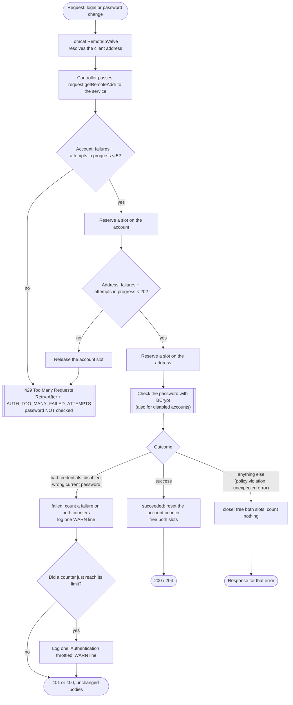
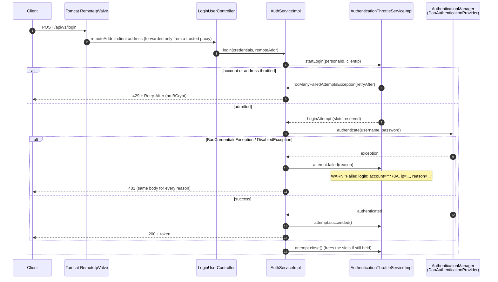
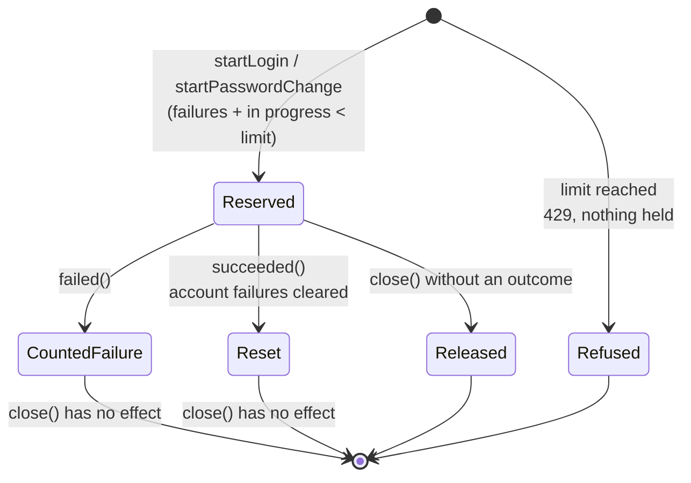
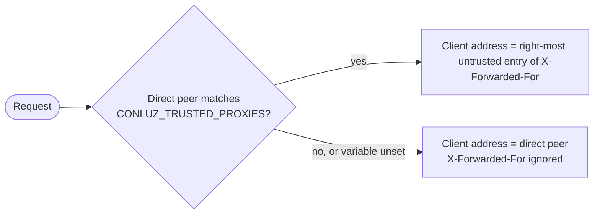

# Authentication throttling

Conluz slows down password guessing on the two endpoints that check a password:

| Endpoint | Password checked |
|---|---|
| `POST /api/v1/login` | the submitted password |
| `PUT /api/v1/users/current/password` | the caller's current password |

Failed attempts are counted per **account** and per **client address**. Once either count reaches its limit,
both endpoints answer **429** with a `Retry-After` header, **without checking the password**, until the counting
window ends. The mechanism was introduced by #332.

The username is the member's NIF, which is semi-public, so there is deliberately **no hard lockout**: an account
is only ever throttled for a bounded time, and it is released on its own.

## The rules

| Rule | Value |
|---|---|
| Failures allowed per account | 5 |
| Failures allowed per client address | 20 |
| Counting window | 15 minutes, starting at the first counted failure |
| `Retry-After` | seconds left until the window ends, rounded up |

- **One account, two endpoints.** Login counts against the normalised submitted `personalId`; password change
  counts against the authenticated user's stored `personalId`, normalised the same way. Both feed the same
  counter, so 3 failed logins plus 2 wrong current passwords throttle the account.
- **Typing variants are one account.** `12345678a`, `12.345.678-A` and `" 12345678 A "` are normalised by
  `UserPersonalId.normalize` before counting, like every user lookup.
- **Unknown accounts are counted like existing ones.** A `personalId` that matches no user has its own counter,
  which behaves exactly the same way, so neither a 401 nor a 429 reveals whether an account exists.
- **What counts as a failure:**
  - login rejected for bad credentials (wrong password or unknown `personalId`);
  - login of a **disabled** account (the password is still checked, see below);
  - a wrong current password on the change endpoint.
- **What does not count:** a new password that breaks the password policy (the current one was right), an
  unexpected error such as the database being unavailable, and refused (429) attempts.
- **Resets.** A successful login or password change resets that **account's** counter. Nothing resets the
  **address** counter: it only ends with its window.
- **While either counter is over its limit** both endpoints refuse. When both are, the longer wait is given.

## How an attempt flows



Every admitted attempt holds its slots until it is **settled exactly once**, as `failed`, `succeeded` or
released by `close`. The callers open the attempt in a `try`-with-resources block, so the slots are freed
whatever ends the attempt.

### Login, step by step



The password change follows the same shape inside `ChangePasswordServiceImpl#changePassword`: the user is loaded,
`startPasswordChange` admits or refuses the change, and only then is the current password compared. A 429 is
raised before anything is written or revoked, so the caller's token stays valid.

## The counting window

Each counter key (an account, or an address) has a **fixed window** that starts at its first counted failure and
lasts 15 minutes. Failures inside it add up; the first failure at or after its end starts a new window.

```mermaid
gantt
    title One account, limit 5, window 15 min
    dateFormat HH:mm
    axisFormat %H:%M
    section Failures
    1st failure starts the window :milestone, 10:00, 0m
    2nd to 4th failure            :milestone, 10:04, 0m
    5th failure, limit reached    :milestone, 10:10, 0m
    section State
    Counting                      :done, 10:00, 10m
    Throttled, Retry-After counts down to 0 :crit, 10:10, 5m
    Window ends, account released :milestone, 10:15, 0m
```



A request at 10:12 in this example gets `Retry-After: 180`. The wait is measured from the **first** failure, not
the last, so continuing to fail does not extend it; an attacker who knows a NIF can, however, keep an account
throttled by sending 5 failures every 15 minutes (an accepted trade-off of not having a hard lockout).

## Attempts in progress and concurrency

A password check with BCrypt takes tens of milliseconds. If the counters were only consulted before the check and
updated after it, a burst of parallel requests could all pass the check before the first failure was recorded,
and get one guess per server thread instead of five.

To prevent that, admission **reserves a slot atomically**. A counter refuses a new attempt while
`failures + attempts in progress >= limit`:



- An attempt holds a slot on **both** counters, or none: if the address refuses, the slot already reserved on the
  account is freed before the 429.
- A refusal caused only by attempts in progress gets the time left in the account's window as `Retry-After`, or a
  whole window when no failure has started one yet, since the attempts in progress would. This is an upper bound:
  if those attempts succeed, the account is free sooner.

## Client address

The client address is `HttpServletRequest#getRemoteAddr()` after Tomcat's `RemoteIpValve`, configured in
`application.properties`:

```properties
server.forward-headers-strategy=native
server.tomcat.remoteip.internal-proxies=${CONLUZ_TRUSTED_PROXIES:}
```



- `CONLUZ_TRUSTED_PROXIES` is a **Java regex** matched against the direct peer's address, i.e. the reverse proxy
  as the application sees it.
- **Unset or empty, no address is trusted.** This overrides Spring Boot's default, which trusts every private range
  (10/8, 172.16/12, 192.168/16, 127/8, …) and would let any client on a private network choose the address it is
  throttled and logged under.
- The `framework` strategy (`ForwardedHeaderFilter`) is not used: it trusts forwarded headers from any client.
- **Behind Docker, match a subnet, not a container address.** Container addresses change when a container is
  recreated; if the regex stops matching the proxy, every request is attributed to the proxy's own address and
  the per-address limit throttles all users together. Put the proxy and Conluz on a network whose subnet is fixed
  in the compose file and match it with a range, e.g. `172\.20\.0\.\d{1,3}` (single-quoted in `.env`). See
  [`deploy/README.md`](../../deploy/README.md).

## Disabled accounts

A disabled account must not be faster to reject than a wrong password, or the response time would reveal which
accounts exist and are disabled. `ApplicationConfig#authenticationProvider` sets
`setAlwaysPerformAdditionalChecksOnUser(true)`: when the pre-authentication check rejects a disabled account,
Spring Security still runs the BCrypt comparison before throwing `DisabledException`. The client gets the same 401
body as for bad credentials, and a disabled user with the right password still cannot log in. This is Spring
Security 6.5's default; it is set explicitly so that a change of default cannot reopen the difference unnoticed.

## Responses

The 401 (login) and 400 (`USER_CURRENT_PASSWORD_INCORRECT`) bodies are unchanged. A throttled attempt gets:

```http
HTTP/1.1 429 Too Many Requests
Retry-After: 843
Content-Type: application/json
```

```json
{
  "timestamp": "2026-10-04T10:10:25.534035352+02:00",
  "status": 429,
  "message": "Too many failed attempts. Please wait before trying again.",
  "traceId": "6e602860-80f7-4802-b20f-8b53fb011013",
  "errors": [
    {
      "message": "Too many failed attempts. Please wait before trying again.",
      "code": "AUTH_TOO_MANY_FAILED_ATTEMPTS",
      "params": { "retryAfterSeconds": "843" }
    }
  ]
}
```

The body is the same whichever counter refused, and whether or not the account exists.

## Logging

All lines are written under the `AuthenticationThrottleServiceImpl` logger, at WARN, without a stack trace.
A password, a token or a full `personalId` is never logged.

| Event | Line |
|---|---|
| Failed login | `Failed login: account=***78A, ip=203.0.113.7, reason=BAD_CREDENTIALS` (or `DISABLED`) |
| Wrong current password | `Failed password change: user=<uuid>, ip=203.0.113.7, reason=WRONG_CURRENT_PASSWORD` |
| A counter reaches its limit | `Authentication throttled: scope=account, account=***78A, retryAfter=900s` (`user=<uuid>` when reached through a password change) |
| | `Authentication throttled: scope=ip, ip=203.0.113.7, retryAfter=900s` |

- The account is masked as `***` followed by its last three characters (only `***` when it has three or fewer);
  characters other than ASCII letters and digits are replaced, since the value comes from the client.
- Exactly one "Failed …" line is written per failed attempt; the attempt that reaches a limit also writes one
  activation line per counter it trips. Refused (429) attempts are not logged one by one.
- These failures are no longer logged again as ERROR by `ErrorBuilder` (`buildWithoutLogging`), so their
  `traceId` does not appear in the server log.

## Memory

The state is kept in memory, which suits the single instance Conluz runs as; it is lost on restart.

- Each counter holds at most **10,000** windows; beyond that, the window that started first is evicted.
- Keys are cut to **64 characters**, since the login body is client-controlled and a real NIF is far shorter.
- Windows are kept in the order they started, so ended windows sit at the head and are purged on every write.
- Attempts in progress are held in a separate map with one entry per key, dropped when its last attempt is
  settled; its size is bounded by the number of requests being processed at once.

## Code map

| Class | Package | Role |
|---|---|---|
| `AuthenticationThrottleService` | `domain/admin/user/auth/throttle` | Port: `startLogin`, `startPasswordChange` |
| `LoginAttempt`, `PasswordChangeAttempt` | `domain/admin/user/auth/throttle` | Handles of an admitted attempt: `failed`, `succeeded`, `close` |
| `LoginFailureReason`, `TooManyFailedAttemptsException` | `domain/admin/user/auth/throttle` | Failure reason (logged only); the refusal carrying `retryAfterSeconds` |
| `AuthenticationThrottleServiceImpl` | `infrastructure/admin/user/auth/throttle` | Limits, account normalisation and masking, admission on both counters |
| `ReservedSlot` | `infrastructure/admin/user/auth/throttle` | One attempt's reservation, settled exactly once; activation log lines |
| `LoginAttemptImpl`, `PasswordChangeAttemptImpl` | `infrastructure/admin/user/auth/throttle` | The handles; failure log lines |
| `FailedAttemptCounter` | `infrastructure/admin/user/auth/throttle` | Windows, reservations, bounds; one instance per scope |
| `AuthenticationThrottleConfig` | `infrastructure/admin/user/auth/throttle` | The `Clock` the windows are measured with |
| `AuthServiceImpl#login`, `ChangePasswordServiceImpl#changePassword` | `infrastructure/admin/user/...` | Open the attempt and settle it with the outcome |
| `AuthenticationExceptionHandler` | `infrastructure/shared/security/auth` | 429 response; failed-login 401 without ERROR logging |
| `TooManyRequestsErrorResponse` | `infrastructure/shared/web/apidocs/response` | The 429 in the OpenAPI document |

## Testing

- **Isolation.** The counters are shared by every test in a Spring context. `BaseIntegrationTest` replaces the
  `Clock` with a `MutableClock`, and `BaseControllerTest` moves it past the window before each test, so no test is
  throttled by another's failures. The limits under test are the production ones.
- **Time** is moved with the same clock, never waited for.
- **Concurrency** is tested by holding every password check open until all parallel requests have either reached
  it or been refused (`AuthServiceImplTest`, `ChangePasswordServiceTest`).
- **Client address** is tested on a real embedded Tomcat (`*ClientAddressTest`), since `RemoteIpValve` does not run
  under MockMvc.

## Known limitations

- Anyone who knows a member's NIF can keep that account throttled by sending 5 failures every 15 minutes. It
  blocks login and password change but exposes no data, and it is visible in the logs.
- Members behind one NAT share the per-address limit.
- Attempts in progress count against the limit, so a member's own login can be refused while an attacker's
  concurrent attempts hold the remaining slots.
- An attacker controlling more than about 500 addresses could fill the 10,000-window bound and evict counters
  early.
- With a trusted proxy configured, `native` also honours `X-Forwarded-Proto`, `X-Forwarded-Host` and
  `X-Forwarded-Port`. No application code reads the request scheme or host today.
