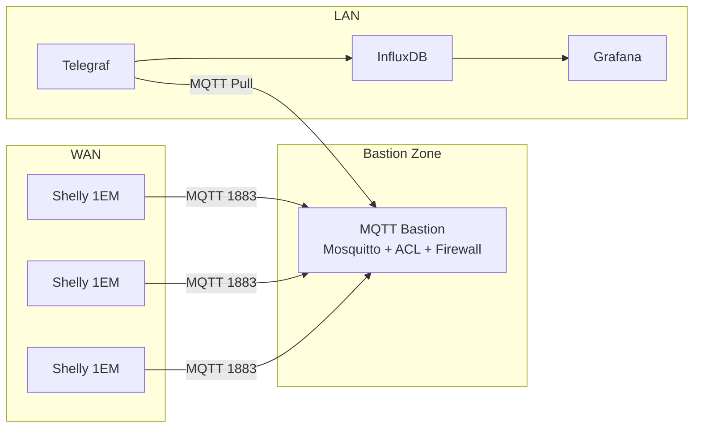
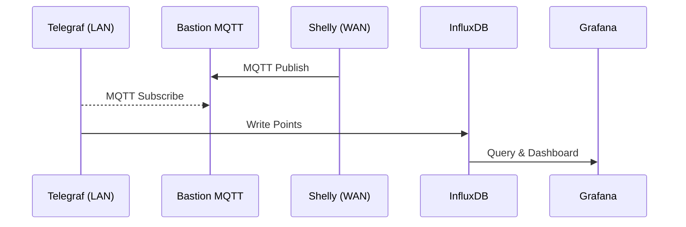

# Raspberry Pi as an MQTT Bastion Broker for Remote Shelly Devices

_Updated: April 2026 — Advanced Enriched Edition_

## 1. Introduction & Motivation

Shelly 1EM devices publish telemetry using **plain MQTT over TCP port 1883**. Because first‑generation Shellys **do not support TLS** or VPN, directly exposing internal servers (InfluxDB, Home Assistant, NAS, Grafana) to WAN-originated MQTT traffic introduces unnecessary risk.

A more secure design places an **MQTT Bastion Broker** between WAN devices and the LAN. The bastion absorbs inbound traffic, authenticates devices, enforces ACLs, and prevents lateral movement into the LAN. Internal analytics systems then **pull** messages from the bastion using MQTT.

---

## 2. High-Level Architecture (Mermaid)



---

## 3. Why a Bastion?

The bastion addresses three threat surfaces:

1. **Untrusted WAN → MQTT Exposure**
2. **LAN Integrity (Zero-Trust / No Pivoting)**
3. **Scalability for 100+ remote nodes**

Alternative designs (e.g., exposing LAN MQTT broker directly) fail at (1) and (2).

---

## 4. Hardware Requirements Explained

A Raspberry Pi 3 Model B is sufficient:

| Component | Requirement | Why |
|---|---|---|
| 1GB RAM | ~50MB for Mosquitto | MQTT is extremely lightweight |
| Quad CPU | 2–5% load with 300 nodes | Message routing + IO minimal |
| NIC 100Mbps | Over 3000× required throughput | Shelly sends <10msg/s in total |

---

## 5. Base OS Preparation

Update packages:

```bash
sudo apt update && sudo apt upgrade -y
```

### 5.1 Disable Non-Essential Services — Why?

Non-essential services consume resources and **increase attack surface**.

Examples:

| Service | Function | Why Disable on Bastion |
|---|---|---|
| `avahi-daemon` | mDNS auto-discovery | Exposes broadcast + ports |
| `cups` | Printing services | Irrelevant and opens TCP ports |
| `bluetooth` | Radio interface | Not used in headless IoT |
| `avahi` | Zeroconf networking | Not needed for WAN MQTT |
| `ssh` (optional) | Remote access | Disable or restrict after config |

Disable example:

```bash
sudo systemctl disable --now avahi-daemon cups bluetooth
```

Disabling removes:

✔ extra listening ports  
✔ broadcast traffic  
✔ privilege-escalation avenues  

---

## 6. Installing Mosquitto Broker

```bash
sudo apt install mosquitto mosquitto-clients -y
```

Minimal config `/etc/mosquitto/mosquitto.conf`:

```
listener 1883
allow_anonymous false
password_file /etc/mosquitto/passwd
acl_file /etc/mosquitto/acl
persistence true
log_dest file /var/log/mosquitto/mqtt.log
```

---

## 7. MQTT User Accounts & ACL Control

Strict ACL prevents spoofing and topic misrouting.

Create users:

```bash
sudo mosquitto_passwd -c /etc/mosquitto/passwd shelly
sudo mosquitto_passwd /etc/mosquitto/passwd telegraf_reader
```

ACL `/etc/mosquitto/acl`:

```
user shelly
topic write shelly/#

user telegraf_reader
topic read shelly/#
```

### Why ACL?

Without ACL:

✖ Any remote node could subscribe to all topics  
✖ Any node could impersonate another  
✖ Data leakage between customers/sites  
✖ Topic flooding (DoS vector)  

With ACL:

✔ Principle of least privilege  
✔ Multi-site support  
✔ Safe multi-tenant scaling  

---

## 8. Network Isolation (Most Critical Component)

Install UFW:

```bash
sudo apt install ufw
```

Default-deny policy:

```bash
sudo ufw default deny incoming
sudo ufw default deny outgoing
```

Allow MQTT ingress (WAN):

```bash
sudo ufw allow 1883/tcp
```

Allow OS-only outbound:

```bash
sudo ufw allow out 53
sudo ufw allow out 80
sudo ufw allow out 443
```

Block outbound to LAN ranges:

```bash
sudo ufw deny out to 192.168.0.0/16
sudo ufw deny out to 10.0.0.0/8
sudo ufw deny out to 172.16.0.0/12
```

### Why Outbound Blocking?

If the bastion is compromised, attacker **cannot lateral scan** or attack:

- NAS
- Home Assistant
- Router web UI
- InfluxDB / Grafana
- Internal MQTT
- SMB/SSH/HTTP services

Outbound-blocking converts the bastion into a **data sink**, not a pivot point.

---

## 9. NAT / Port Forwarding

On router:

```
External Port: 1883 (TCP)
Internal Port: 1883 (TCP)
Target: Bastion IP
```

Verify from mobile WAN:

```
telnet <public_ip> 1883
```

---

## 10. Shelly MQTT Configuration (WAN)

Configure each Shelly:

```
Server: <public_ip_or_domain>:1883
User: shelly
Password: xxxx
Update Period: 60s recommended
```

---

## 11. Telegraf Pull from LAN (Mermaid Example)



Telegraf config:

```toml
[[inputs.mqtt_consumer]]
  servers = ["tcp://192.168.1.200:1883"]
  topics = ["shelly/#"]
  username = "telegraf_reader"
  password = "xxxx"
  data_format = "json"
```

---

## 12. Monitoring & Alerting (New Section)

Monitor KPIs:

| KPI | Why |
|---|---|
| Client count | Detect fleet outages |
| Messages/s | Detect flooding |
| Auth failures | Detect brute force or config errors |
| Disconnect rate | Detect WAN link issues |
| Retain misuse | Detect state poisoning |
| CPU + mem | Detect DoS attempts |

Telegraf input:

```toml
[[inputs.mosquitto]]
  servers = ["tcp://192.168.1.200:1883"]
```

Alerting via Grafana:

✔ Outage if client count drops  
✔ Alarm if auth failures spike  
✔ DoS if msg/s rises abnormally  

Optional: send alarms to:

- Telegram
- Slack
- Email
- Webhooks

---

## 13. Threat Model (Summary)

Threats mitigated:

✔ Remote LAN pivot  
✔ Credential abuse  
✔ Topic hijacking  
✔ Device impersonation  
✔ Multi-tenant leakage  
✔ Cloud dependency  

Remaining risk:

- Bastion DoS (acceptable for architecture)
- Data spoofing (detected via validation)

---

## 14. Conclusion

Using a Raspberry Pi as an MQTT Bastion Broker provides a **zero-trust buffer** for remote IoT fleets.  
By enforcing ACLs, outbound-blocking, and pull-based LAN ingestion, the design scales securely to hundreds of remote Shelly devices without exposing vital analytics systems.

